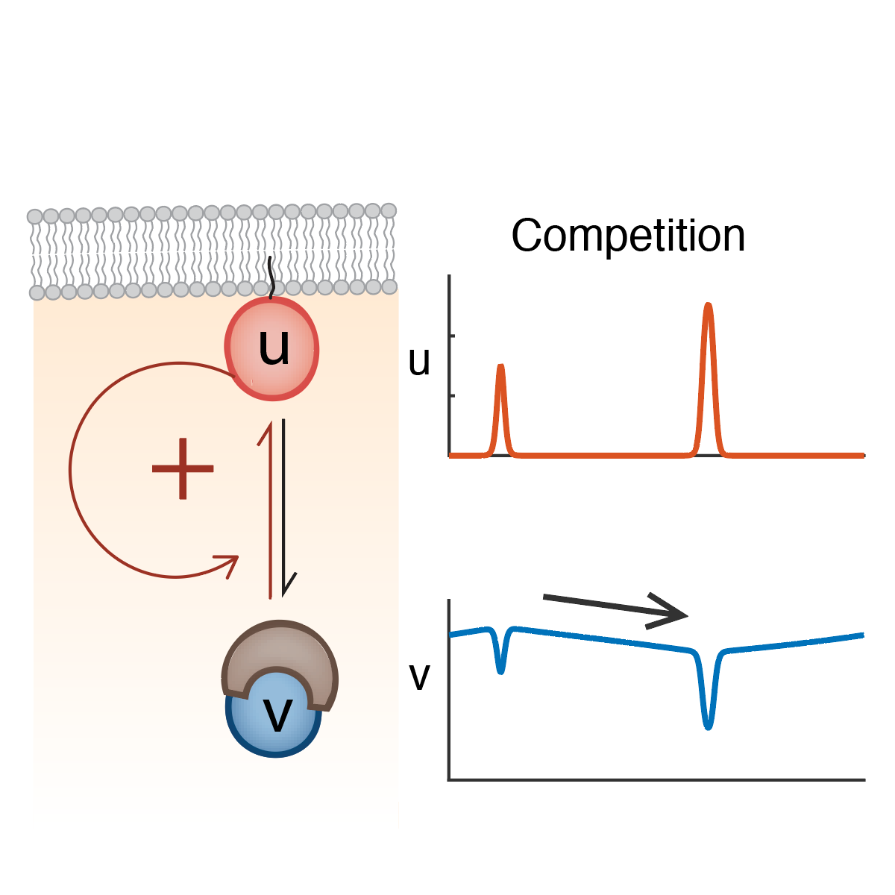

<header>
	

		<h1>Research</h1>
	

</header>

<section id="PatternFormation">
	

		<h3>Patterning in an interdisciplinary field</h3>
		
Pattern formation is a critical and fascinating process in the development of multicellular organisms. Typically, a homogenous egg or a piece of tissue require certain proteins/mRNA to be spatially localized heterogeneously (patterned) to develop complex structures. The molecular pathways underlying different patterning systems are usually distinct depending on the system. However, they often follow similar pattern formation principles.
 
		
<video width="200" height="200" autoplay loop><source src="assets/videos/TuringTuring_thinshort.mp4" type="video/mp4"></video>The Turing pattern is a good example of pattern formation principles. In 1952, Alan Turing (yes, Benedict Cumberbatch in the <i>Imitation Game</i>) demonstrated that a system that consists of a slow-diffusing "activator" activating a fast-diffusing "substrate" can spontaneously generate patterns such as spots and strips. This pattern has been shown to underly the patterning of pigments on animal coat, the development of animal digits, the distribution of tricomes on plant leafs, even the vegetation in savana lanscapes.

		
Since mathematical principles of pattern formation often transcend taxonomic boundaries and even spatial scales, why can't patterning also occur in 'unicellular' microbes? In our lab, we use interdisciplinary approaches including <b>live cell microscopy</b> and <b>mathematical modeling</b> to studies the <b>principles of pattern formation</b> that play key roles in <b>microbial developmental processes</b>. Specifically, we focus on two aspects:

	

</section>

<section id="CellPolarity">
	

		<h3>Cell Polarity</h3>
			
Different cells develop in different cell polarity modes: Pollens only grow toward one direction to develop a single pollen tube; neurons grow toward multiple directions when forming dendrites. Contrasting polarity modes as such originate from the different spatial patterns of polarity proteins within a single cell. Previous studies have shown that the mathematical principles that govern the patterning of polarity proteins in the budding yeast (a member of the Ascomycota phylum) follow that of a mass-conserved version of the Turing system, the system that generates the spots and stripes on your cat! However, a cat can have many spots and stripes, but the budding yeast always pattern their polarity proteins to produce only one bud per cell cycle. What is the underlying mechanism?

			
The question of how cells control the number of polarity sites is as much a biological question as a mathematical one. If having multiple polarity sites is mathematically unstable, the polarity sites will compete with each other and eventually the largest one will be the only one remaining. In 2018, we published the conditions in a minimalistic Mass-conserved Turing model that determine the degree of instability of the polarity sites (<a href="d_Publications.html#2018PloSCompBio">Chiou et al., 2018, <i>PLoS Comp. Bio.</i></a>). Elucidating the underlying mathematical principles of yeast cell polarity has allowed us to genetically remodel the growth of budding yeast. We changed budding yeast cells from unipolar budding to multipolar growth, resembling lateral branching of fungal hyphae (<a href="d_Publications.html#2022ELife">Chiou et al., 2021, <i>eLife</i></a>).

			
A second discovery from our 2021 paper is that if we consider a slightly more realistic version of the same mathematical model, more complicated polarity modes emerge from one single model. In addition to competition (where only one polarity site can last), there are scenarios of equalization (where multiple polarity sites can stably exist and equalize) and splitting (where even one polarity site is unstable). Coincidentally, genetic and genomic data confirmed that the entire Ascomycota phylum shares the same conserved polarity machinery. Despite that, Ascomycete fungi feature diverse polarity modes including unipolar budding in the budding yeast, New End Take Off (NETO) in the fission yeast, and apical hyphal branching in multiple filamentous fungi species, corresponding to theoretical predictions. Combining the two pieces of information from theory and experiments, we ask the bigger question: What if these theoretical predictions correspond to diverse polarity modes of other Ascomycete fungi? Starting from the perspective of dynamic systems theory using partial differential systems, we test whether genetic evidence in each individual Ascomycete species would support the same theoretical framework. If that is the case, Ascomycota would become a model phylum in understanding diverse cell polarity modes in general.

	

</section>

<section id="BiofilmDevelopment">
	

		<h3>Biofilm Development</h3>
			
The general textbook impression of bacteria is that they are unicellular organisms. However, most bacterial species can in fact develop into multicellular communities called biofilms. Although each bacterium in a biofilm is an individual organism, biofilm as an entity shares many surprising features with true multi-cellular organisms. Studies have shown that Bacillus subtilis cells within a biofilm can communicate with each other through electrochemical signals similar to action potential within neurons. The latest research has shown that B. subtilis biofilms can develop concentric segments driven by molecular clocks in individual bacterial cells, similar to vertebrate somitogenesis, and use this pattern to control cell differentiation. 

			
Cell-autonomous oscillations within individual cells are the driving forces of segmentation. However, when each cell has an independent clock, the expectation of the macroscopic pattern is a field of blurred noise. To generate concentric rings with sharp boundaries, a mechanism that synchronizes and couples the clocks has to exist, just like how fireflies turn bright simultaneously on the same tree. How do molecular clocks talk to each other? Would it be electrochemical signals? We are planning to solve the key problem of synchronization under microscopic live imaging.
			

	

</section>